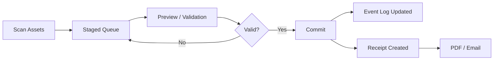
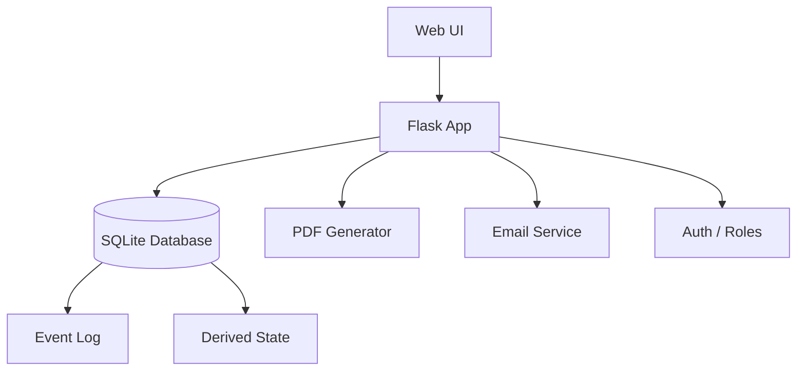
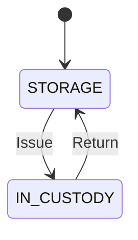

## AssetTrack Workflow
### “Scan → Review → Commit”

```mermaid
flowchart LR
    A[Scan Assets] --> B[Staged Queue]
    B --> C[Preview / Validation]
    C --> D{Valid?}
    D -- No --> B
    D -- Yes --> E[Commit]
    E --> F[Event Log Updated]
    E --> G[Receipt Created]
    G --> H[PDF / Email]
```

## System Architecture

```mermaid
flowchart TB
    UI[Web UI] --> APP[Flask App]
    APP --> DB[(SQLite Database)]
    APP --> PDF[PDF Generator]
    APP --> EMAIL[Email Service]

    DB --> EVENTS[Event Log]
    DB --> STATE[Derived State]

    APP --> AUTH[Auth / Roles]
```

## Asset State Model

```mermaid
stateDiagram-v2
    [*] --> STORAGE
    STORAGE --> IN_CUSTODY: Issue
    IN_CUSTODY --> STORAGE: Return
```